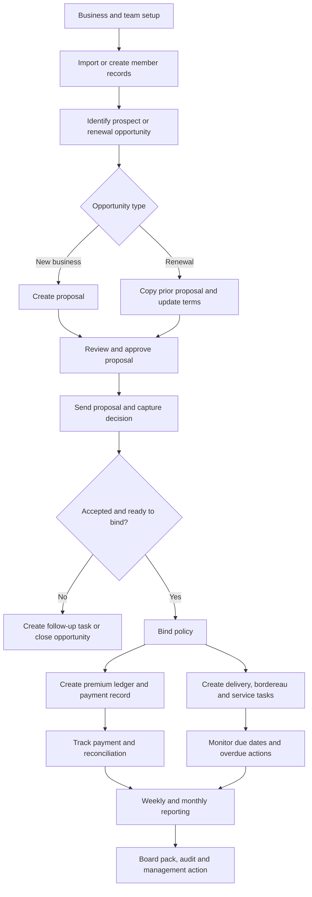
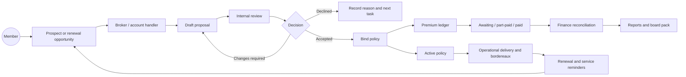
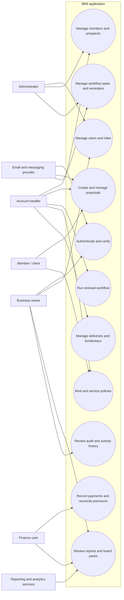
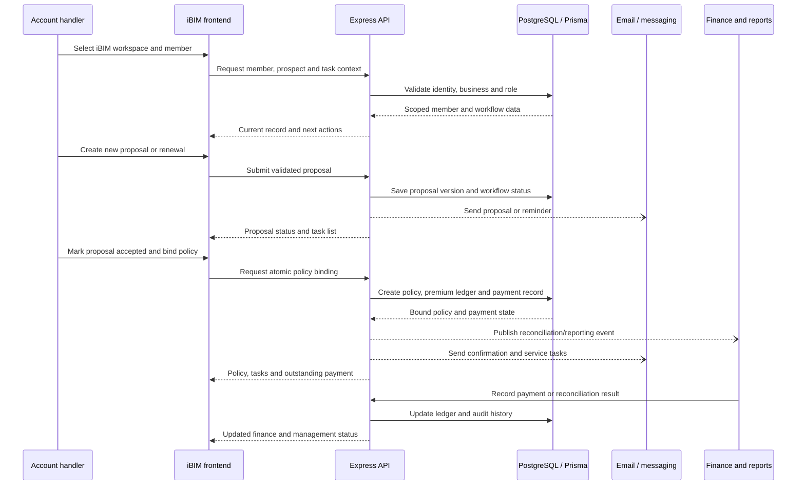
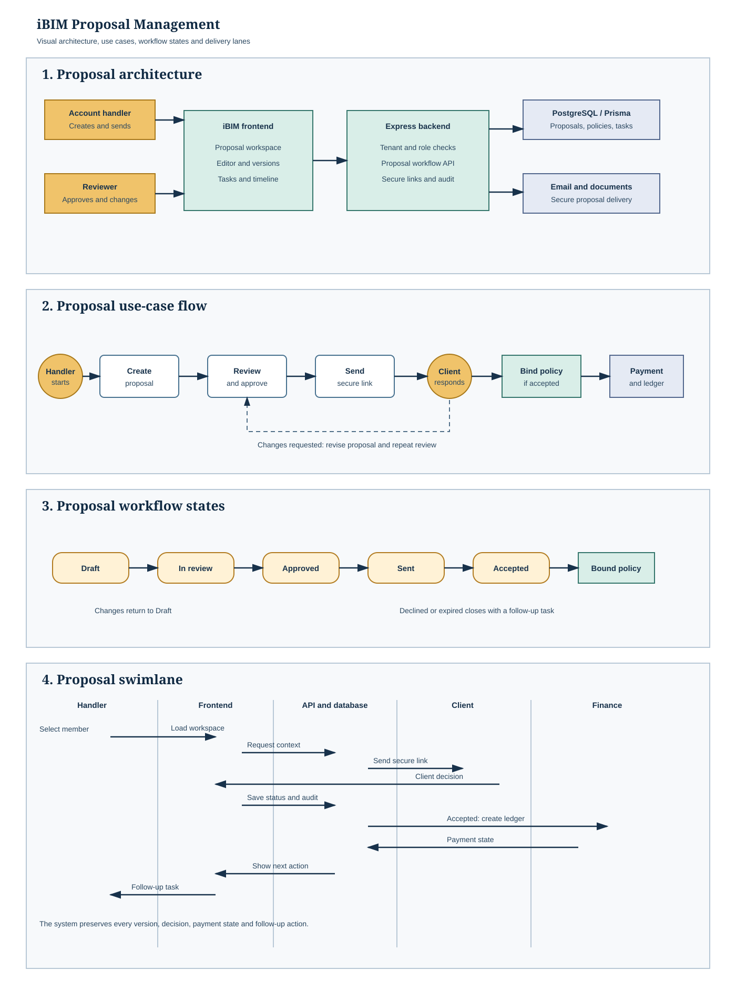
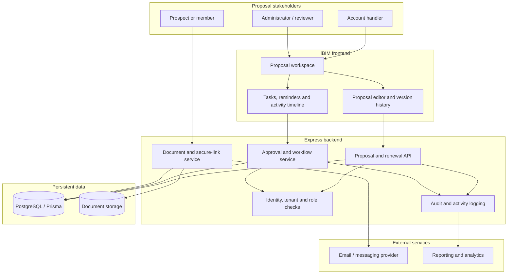
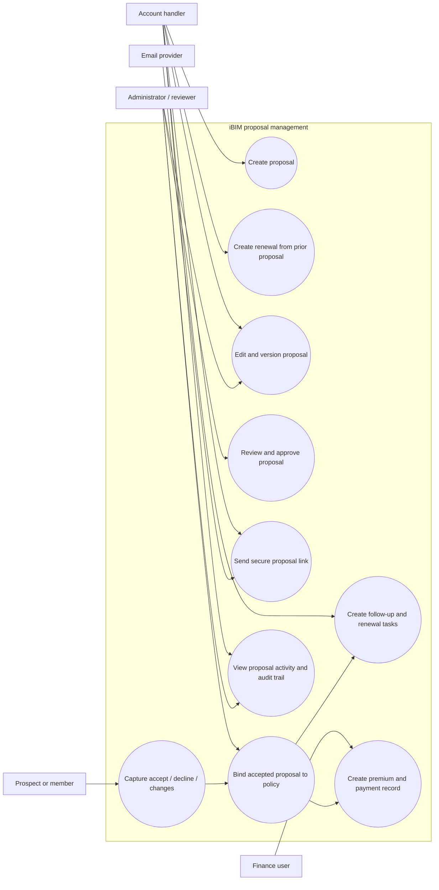
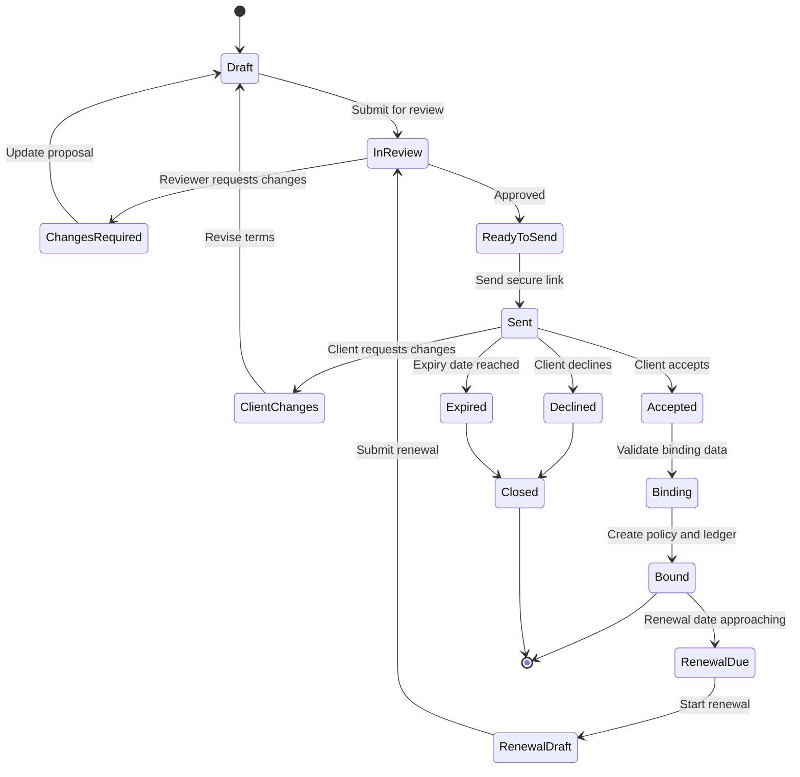
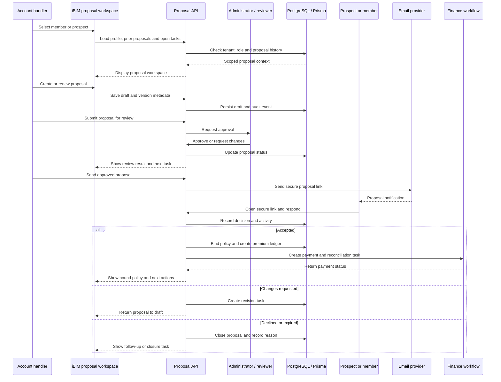

# iBIM Scope, Workflows and Indicative Pricing

**Estimate basis:** production-ready iBIM web application, GBP, ex VAT  
**Estimate date:** 9 September 2026  
**Status:** indicative planning estimate, not a supplier quotation

## 1. Pricing (ex VAT)

This estimate covers the iBIM insurance operations application only. YardLogic ERP features such as stock, sales invoices, purchase bills, GST reports and construction materials are excluded.

| Module | iBIM scope | Current position | Indicative maximum |
|---|---|---:|---:|
| 1. Discovery and solution design | Requirements, acceptance criteria, operating model, data and workflow design | Foundation exists | £2,500 |
| 2. Identity, tenancy and RBAC | Sign-up/login, email verification, JWT, 2FA, business isolation and team roles | Built; provider/config hardening remains | £4,000 |
| 3. Member and prospect management | Member records, imports, duplicate checks, prospects, segmentation and activity history | Core workflow built; acceptance polish remains | £5,000 |
| 4. Proposal and renewal management | New-business proposals, renewals, versions, statuses, approvals and signed proposal access | Substantial workflow built | £8,000 |
| 5. Policy and coverage operations | Binding, policy records, premium ledger, policy status, coverage data and lifecycle actions | Core workflow built; edge cases remain | £8,000 |
| 6. Workflow, tasks and service delivery | Work queues, reminders, overdue buckets, campaigns, deliveries, bordereaux and reconciliation | Substantial workflow built; final acceptance remains | £8,000 |
| 7. Finance and payment reconciliation | Payments, part-paid/paid states, rebates, premium reconciliation and finance reporting | Core workflow built; production hardening remains | £6,000 |
| 8. Documents, communications and integrations | Email delivery, document metadata, secure proposal links, webhooks and provider seams | Seams built; live provider setup remains | £3,500 |
| 9. iBIM dashboards and reporting | Operational dashboard, weekly/monthly reporting, board pack, audit and management reports | Core reporting built; refinement remains | £4,500 |
| 10. Frontend UX and offline operation | iBIM workspace navigation, responsive screens, loading/error states, local cache and sync recovery | Built across major surfaces; UX consistency pass remains | £6,000 |
| 11. QA, security and deployment | Role tests, tenant isolation, migration rehearsal, monitoring, backups, release and runbook | Deployment exists; final verification remains | £5,000 |
| **Maximum planning total** |  |  | **£60,500** |

### Midrange cost estimate

The following table is intended for a realistic midrange planning conversation. The low figure assumes a narrow launch scope and reuse of the existing implementation. The maximum figure allows for full hardening, acceptance testing and operational edge cases.

| Module | Low estimate | **Midrange estimate** | Maximum estimate |
|---|---:|---:|---:|
| Discovery and solution design | £2,000 | **£2,000** | £2,500 |
| Identity, tenancy and RBAC | £3,000 | **£3,500** | £4,000 |
| Member and prospect management | £4,000 | **£4,000** | £5,000 |
| Proposal and renewal management | £5,500 | **£6,500** | £8,000 |
| Policy and coverage operations | £5,500 | **£6,500** | £8,000 |
| Workflow, tasks and service delivery | £5,500 | **£6,500** | £8,000 |
| Finance and payment reconciliation | £4,000 | **£5,000** | £6,000 |
| Documents, communications and integrations | £2,500 | **£3,000** | £3,500 |
| iBIM dashboards and reporting | £3,000 | **£3,500** | £4,500 |
| Frontend UX and offline operation | £4,000 | **£5,000** | £6,000 |
| QA, security and deployment | £3,500 | **£4,000** | £5,000 |
| **Total ex VAT** | **£42,500** | **£49,500** | **£60,500** |
| **Total including 20% VAT** | **£51,000** | **£59,400** | **£72,600** |

**Recommended midrange budget:** **£49,500 ex VAT**, or **£59,400 including 20% VAT**. Add a 15% contingency to the midrange figure for a prudent approval budget of **£56,925 ex VAT**.

### Attachment-aligned module breakup

This is the more detailed breakup based on the supplied iBIM workflow document. It supersedes the broad planning table above when pricing the requested operational platform. The estimate assumes a midrange implementation with the existing application foundation reused where practical.

| No. | Delivery module | Included scope from the workflow | Midrange estimate ex VAT |
|---:|---|---|---:|
| 1 | Discovery, process mapping and acceptance design | Confirm master-record fields, statuses, spreadsheet layouts, rating inputs, email templates, roles and acceptance criteria | £3,000 |
| 2 | Main dashboard and navigation | Workspace, Finance & Accounts, Business Insights, role-aware navigation, alerts, status cards and date filters | £3,000 |
| 3 | Master Record and member data | CND/master spreadsheet import, field mapping, validation, date ordering, single source of truth, history and audit trail | £6,000 |
| 4 | Prospects and six-week campaign | Prospect import, renewal-date calculation, six-week identification, proposal attachment, bulk scheduler, test email, register and pipeline metrics | £6,000 |
| 5 | New Business intake | Website enquiry capture, automatic acknowledgement, proposal form, source tracking, master-record merge and enquiry dashboard | £5,000 |
| 6 | Renewals automation | Daily renewal check, six-week invitation, pre-population from prior record, 14-day chases, overdue escalation, traffic lights and retention metrics | £7,000 |
| 7 | Quote, rating and underwriting workflow | Proposal returned, rating matrix seam, underwriting queue, gross premium, IPT, fees, commission, net premium, year-on-year comparison and approvals | £7,500 |
| 8 | Acturis handoff and quotation tracking | Acturis reference, quote prepared/sent states, handler ownership, quotation documents, response outcomes and follow-up reminders | £4,500 |
| 9 | Post-bind operational registers | Policy binding, locked key fields, audit event, Bordereaux, New Business and Renewals registers, monthly close, Excel/PDF export | £5,000 |
| 10 | Standalone rebates module | Mutual aggregate pot, annual allocation, member entitlement, statements, payment schedule, payment history and rebate reports | £4,000 |
| 11 | Finance and payments | Payment records, BACS/finance paths, paid/part-paid/overdue states, finance documents, alerts, premium and commission entries | £5,000 |
| 12 | Budget management | Annual/monthly/income-stream budgets, budget versus actual, variance, forecast, run rate and traffic-light status | £4,000 |
| 13 | Business insights and board reporting | Weekly/monthly reports, board pack, KPI dashboard, conversion, member growth, income, commission, rebate, product and YTD analysis | £5,500 |
| 14 | Communications, documents and integrations | Approved templates, stored email copies, secure links, attachment handling, provider setup, spreadsheet links and scheduled reporting | £4,000 |
| 15 | QA, security, migration and go-live | Tenant/RBAC tests, workflow regression, spreadsheet migration rehearsal, monitoring, backups, training and release runbook | £5,500 |
|  | **Attachment-aligned midrange total** |  | **£75,000** |

#### Attachment-aligned price range

| Scenario | Description | Ex VAT | Including 20% VAT |
|---|---|---:|---:|
| Lean launch | Reuse current screens and data model; limited Acturis/spreadsheet automation; essential reports only | £58,000 | £69,600 |
| **Midrange recommended** | **All modules above with full workflow acceptance and standard exports** | **£75,000** | **£90,000** |
| Maximum planning ceiling | Full automation, broader spreadsheet compatibility, extensive reporting, migration and launch support | £92,000 | £110,400 |

For the recommended midrange implementation, add 15% contingency for data quality, provider configuration and spreadsheet variations: **£86,250 ex VAT** or **£103,500 including VAT**.

### Recommended budget position

- **Full iBIM scope maximum:** **£60,500 ex VAT**.
- **Likely remaining delivery budget from the current repository:** **£22,000-£30,000 ex VAT**, subject to an acceptance audit and confirmation of launch integrations.
- **15% contingency ceiling:** **£69,575 ex VAT**.
- **VAT at 20% if applicable:** £60,500 becomes **£72,600 including VAT**. The contingency ceiling becomes **£83,490 including VAT**.

### Exclusions and recurring costs

The figures exclude third-party usage and subscription charges:

- hosting, database, object storage, CDN and monitoring;
- Gmail/Google Cloud, AI and BigQuery usage;
- email, SMS or WhatsApp delivery fees;
- insurance, policy, payment or reconciliation provider fees;
- legal/compliance review, penetration testing, data migration and ongoing support.

The estimate assumes one responsive iBIM web application, one shared backend, the existing React/Vite and Express/Prisma architecture, and no native mobile application.

## 2. iBIM operating workflow

## 3. Renewal and new-business flow graph

## 4. iBIM use-case diagram

## 5. iBIM swimlane

## 6. Proposal architecture diagram

The image above is the presentation version. The Mermaid definitions below remain available for editing and reuse.

## 7. Proposal use-case diagram

## 8. Proposal workflow Mermaid diagram

## 9. Proposal swimlane diagram

## 10. Module acceptance gates

| Gate | Minimum evidence |
|---|---|
| Workflow | New business, renewal, decline, follow-up and binding paths tested |
| Security | Business isolation, role permissions and secure proposal access checked |
| Finance | Bound policy creates one payment record and reconciliation states are correct |
| Communications | Provider success, provider failure and missing credentials tested |
| Operational | Reminders, overdue tasks, deliveries and bordereaux are traceable |
| Reporting | Weekly, monthly, board and audit outputs reconcile to source records |
| User acceptance | Named iBIM owner signs off representative member and policy journeys |

## 11. Suggested iBIM delivery order

1. Confirm iBIM roles, policy terminology, acceptance criteria and launch integrations.
2. Complete production authentication, email delivery and tenant/RBAC verification.
3. Finish member, prospect, proposal and renewal acceptance journeys.
4. Complete policy binding, premium ledger, payment and reconciliation controls.
5. Complete task automation, deliveries, bordereaux and reminder handling.
6. Finish reporting, board pack, audit, security and migration verification.
7. Release a monitored iBIM pilot, then move to general availability.

