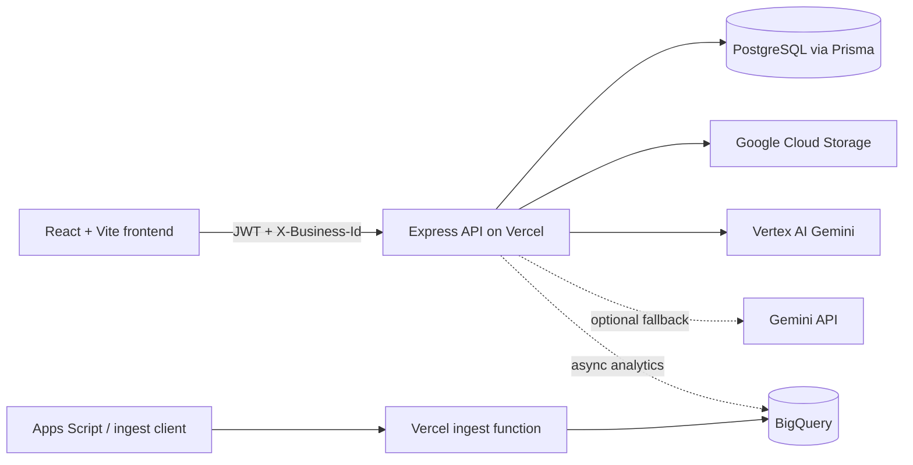
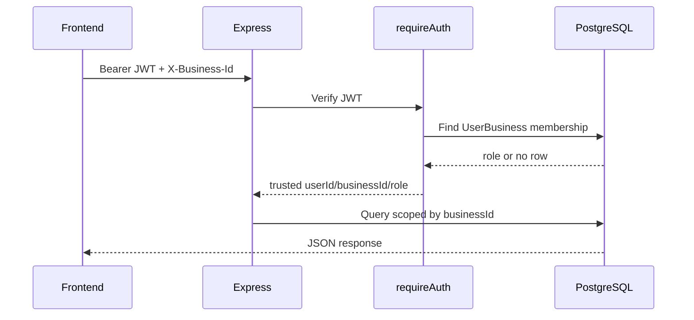
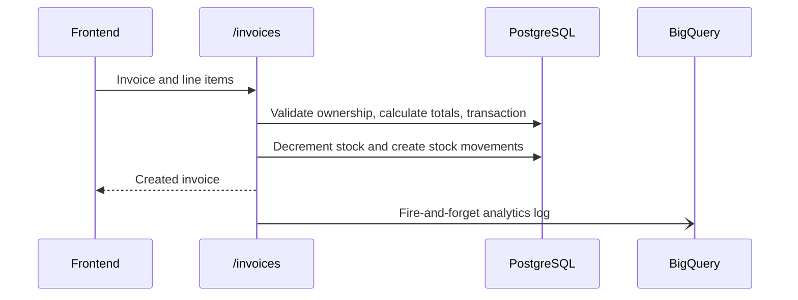
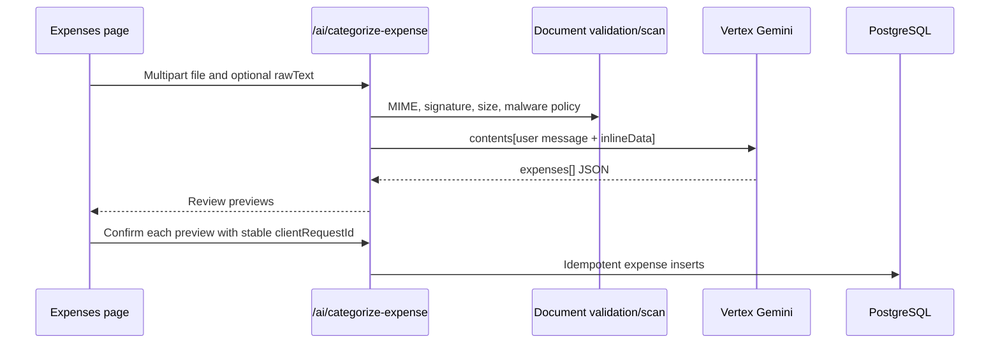
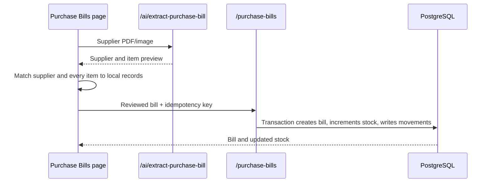
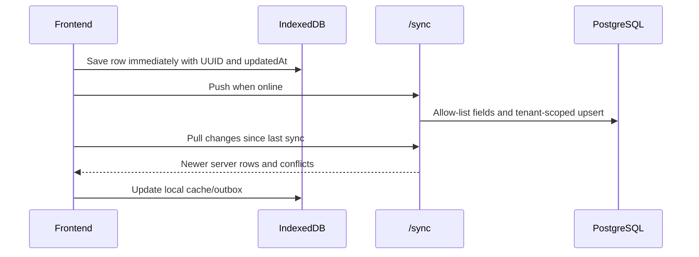
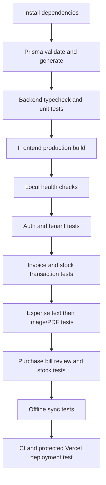

# YardLogic Current Architecture and Testing Guide

This document describes the checked-in application as it exists now. Source code, the Prisma schema, migrations, and GitHub Actions are authoritative; older Buildwise guides may describe planned or outdated behavior.

## 1. Product Shape

YardLogic is a multi-tenant business ERP for billing, purchasing, inventory, expenses, payments, GST preparation, supplier/customer workflows, and AI-assisted document processing.



## 2. Technology and Runtime

| Layer | Current implementation |
|---|---|
| Frontend | React 18, TypeScript, Vite, Vercel static deployment |
| Backend | Express, TypeScript, Prisma 5, Vercel serverless entrypoint |
| Database | PostgreSQL; `backend/prisma/schema.prisma` is the source of truth |
| Authentication | JWT bearer tokens, business membership, OTP, optional TOTP |
| Tenant scope | `X-Business-Id`, verified by `requireAuth` against `UserBusiness` |
| AI | Vertex AI Gemini; Gemini API fallback when configured |
| Files | Multer memory uploads, validation, optional ClamAV scan, GCS services |
| Analytics | BigQuery logging plus standalone `vercel-ingest` endpoint |
| CI | `.github/workflows/ci.yml` |
| Deployment | `.github/workflows/deploy.yml`, Vercel, Prisma migrations, BigQuery schema |

## 3. Repository Map

```text
yardlogic-app/
  backend/
    api/index.ts                 Vercel serverless entrypoint
    src/app.ts                   Express middleware, health routes, routers
    src/routes/                  Auth and business feature APIs
    src/services/googleCloud.ts  Vertex, GCS, BigQuery, document validation
    src/services/aiWallet.ts     AI credits and daily usage limits
    src/services/notifyService.ts OTP/email/SMS provider seams
    src/middleware/auth.ts       JWT and business membership enforcement
    prisma/schema.prisma         PostgreSQL model source of truth
    prisma/migrations/           Applied database migrations
  frontend/
    src/App.tsx                  Application shell and page routing
    src/components/Layout.tsx    Navigation and business switcher
    src/pages/                   Business workflows
    src/lib/api.ts               JWT, tenant header, timeout, GET retries
    src/lib/offlineDb.ts         IndexedDB cache
    src/lib/syncManager.ts       Offline outbox and pull/push sync
  vercel-ingest/
    api/insert.ts                 Authenticated BigQuery insert function
    lib/bigquery.ts               Row normalization and allow-lists
  appscript/Code.gs              Apps Script data sender
  bigquery/schema.sql             Analytics schema
```

## 4. Request and Data Flows

### 4.1 Authenticated request



Every protected route depends on this boundary. Tests must verify both valid membership and cross-business rejection.

### 4.2 Invoice creation



PostgreSQL is the accounting source of truth. BigQuery logging must not determine whether the invoice succeeds.

### 4.3 Expense image/PDF categorization



Current behavior:

- One request accepts one file; the UI processes selected files sequentially.
- One document may return multiple expense rows, capped by the backend at 100.
- The frontend batch limit must be verified in the deployed `Expenses.tsx` before relying on a 10-file limit.
- Duplicate confirmation is protected by `Expense.clientRequestId`.
- Standard Vercel runtimes do not provide `clamscan`; if scanning is disabled, MIME and file-signature checks still run.

### 4.4 Supplier invoice to stock



Extraction is a preview only. It must not change stock until the reviewed purchase bill is saved.

### 4.5 Offline sync



The current sync allow-list is `item`, `customer`, `supplier`, and `expense`. Invoices and purchase bills are not currently offline-syncable through this route.

## 5. Feature Inventory

### Implemented and routed

- Authentication, OTP, password login, TOTP setup, JWT sessions
- Multi-business membership and role checks
- Business profile and setup status
- Customers and suppliers, supplier ledger and aging
- Items, stock movements, low-stock views, material templates
- Invoices, invoice items, payments, PDF/public invoice access
- Estimates and invoice conversion
- Delivery challans
- Purchase bills, payments, cancellation, stock increment, returns
- Manual expenses and AI expense previews/confirmation
- Bank statement upload and reconciliation
- GST preparation and reconciliation data
- Compliance document upload and AI organization
- Notifications, preferences, approvals
- Growth, campaigns, loyalty, forecasts, operations, advanced workflows
- Offline IndexedDB cache and sync for four models
- BigQuery analytics and standalone ingest allow-list

### Implemented but integration-dependent

- Vertex AI requires working model access, region, IAM, and quota.
- Gemini fallback requires `GEMINI_API_KEY`.
- Gmail OTP requires Gmail OAuth variables.
- SMS requires Twilio or MSG91 variables.
- GCS and BigQuery require valid Google credentials and permissions.
- GST filing/e-invoice/e-way-bill provider actions require a configured GSP.
- Payment gateway provider remains a guarded integration seam.
- ClamAV scanning is unavailable on standard Vercel runtimes unless separately hosted.

### Partial or needs verification

- Older documents claim Claude fallback; current source uses Gemini API fallback.
- `isSubscriptionActive` currently returns true and is not a real subscription check.
- Several advanced modules have routes/models but need end-to-end UI verification.
- BigQuery schema comments and older JSON schemas can drift from Prisma.
- The deployment workflow must explicitly pass every production variable it expects; verify malware-scan and AI-cost variables are forwarded.

## 6. Environment Checklist

### Backend runtime

```text
DATABASE_URL
JWT_SECRET
CORS_ORIGINS
GOOGLE_CLOUD_PROJECT_ID
GCP_SERVICE_ACCOUNT_KEY or GOOGLE_APPLICATION_CREDENTIALS
GCS_BUCKET
BIGQUERY_DATASET
BIGQUERY_REGION
VERTEX_AI_ENABLE
VERTEX_AI_LOCATION
VERTEX_AI_MODEL_ID
GEMINI_API_KEY (fallback)
GEMINI_MODEL_ID
VERTEX_AI_SUBSCRIPTION_REQUIRED
AI_DAILY_FREE_TOKENS
AI_DAILY_FREE_CHATS
AI_COST_ASK
AI_COST_CATEGORIZE_EXPENSE
AI_COST_GENERATE_REPORT
AI_COST_INVOICE_INSIGHTS
AI_COST_EXTRACT_PURCHASE_BILL
MALWARE_SCAN_ENABLED
MALWARE_SCAN_REQUIRED
CLAMAV_COMMAND
```

Never expose backend secrets through `VITE_*` variables. After changing Vercel environment variables, redeploy; existing serverless deployments do not reload environment values.

## 7. Test Commands

Run from PowerShell at the repository root:

```powershell
# Backend
Set-Location .\yardlogic-app\backend
npm ci
npx prisma generate
npx prisma validate
npx tsc --noEmit
npm test
npm run build

# Frontend
Set-Location ..\frontend
npm ci
npm run build

# Standalone BigQuery ingest
Set-Location ..\vercel-ingest
npm ci
npx tsc --noEmit --target ES2022 --module commonjs --moduleResolution node --esModuleInterop --skipLibCheck api/insert.ts lib/bigquery.ts

# Repository hygiene
Set-Location ..\..
git diff --check
```

PowerShell does not use `\` for line continuation. Run one command per line or use a PowerShell backtick carefully. Do not append `\` to `git commit`.

## 8. Local Smoke Test

1. Copy `backend/.env.example` to `backend/.env` and fill database/auth values.
2. For local uploads, either install ClamAV and set scanning true, or use:
   `MALWARE_SCAN_ENABLED=false` and `MALWARE_SCAN_REQUIRED=false`.
3. Run `npm run dev` in `backend`.
4. Run `npm run dev` in `frontend`.
5. Verify:

```powershell
Invoke-RestMethod http://localhost:4000/health
Invoke-RestMethod http://localhost:4000/health/db
Invoke-RestMethod http://localhost:4000/health/google-cloud
```

6. In the UI, test login, business switching, item creation, invoice creation, expense text categorization, one receipt image, repeated receipt confirmation, purchase-bill preview, and a stock update.

## 9. End-to-End Test Matrix

| Area | Test | Expected result | Current automation |
|---|---|---|---|
| Auth | Invalid JWT | 401 | Backend unit coverage is limited |
| Tenant security | User changes `X-Business-Id` | 403 | Add integration test |
| Invoice | Invalid item ownership | 4xx and no stock mutation | Add integration test |
| Invoice | Retry with same idempotency key | One invoice | Add integration test |
| Purchase bill | Save reviewed bill | Bill + stock movement in one transaction | Add integration test |
| Expense | Text categorization | Review array | AI provider test needed |
| Expense | Image/PDF categorization | Review array | AI/provider test needed |
| Expense | Same receipt twice | No duplicate rows | Add database integration test |
| Upload security | Wrong MIME/signature | Rejected | Unit covered |
| Upload security | ClamAV unavailable | Explicit skip or rejection per env | Unit/integration gap |
| Offline sync | Offline write then reconnect | Outbox flushes | Add browser/integration test |
| GST | Invalid period | 400 | Add route tests |
| Notifications | Low stock/overdue trigger | Notification created | Add service tests |
| Deployment | Backend health | JSON `{ ok: true }` | CI health probe |
| Deployment | Frontend API URL | Stable backend alias | CI build only |

## 10. Known Risks and Missing Tests

1. AI provider integration is not covered by automated tests. Current tests validate JSON parsing and file validation, not a real Vertex request.
2. Tenant isolation needs integration tests. `requireAuth` is central and should be tested against a test database or mocked Prisma boundary.
3. Idempotency races need tests. A unique database constraint protects the final write, but concurrent retry behavior should be verified.
4. Purchase bill totals and stock rollback need transaction tests. Test create, edit, cancel, and concurrent payment cases.
5. The frontend has no browser-level test suite. Add Playwright coverage for login, invoice creation, expense review, and upload failure states.
6. Environment forwarding can drift. Keep `.env.example`, deploy workflow, and Vercel project variables synchronized.
7. Documentation drift is real. Older files refer to Buildwise, Claude, old regions, and planned routes. Prefer this guide and current source.

## 11. Recommended Test Order



## 12. Definition of Done

Consider a release ready only when:

- Backend type-check, Prisma validation, tests, and build pass.
- Frontend build passes.
- `/health`, `/health/db`, and `/health/google-cloud` are healthy in the target environment.
- Tenant isolation is tested for at least one read and one write route.
- Invoice, purchase bill, return, and payment transactions have rollback tests.
- Expense text, image, PDF, multi-document, invalid-file, and duplicate-retry cases pass.
- Production environment variables are verified without exposing values.
- The deployed frontend calls the stable backend API URL.
- CI deployment checks the same commit that was built and tested.
